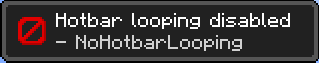
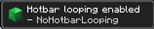
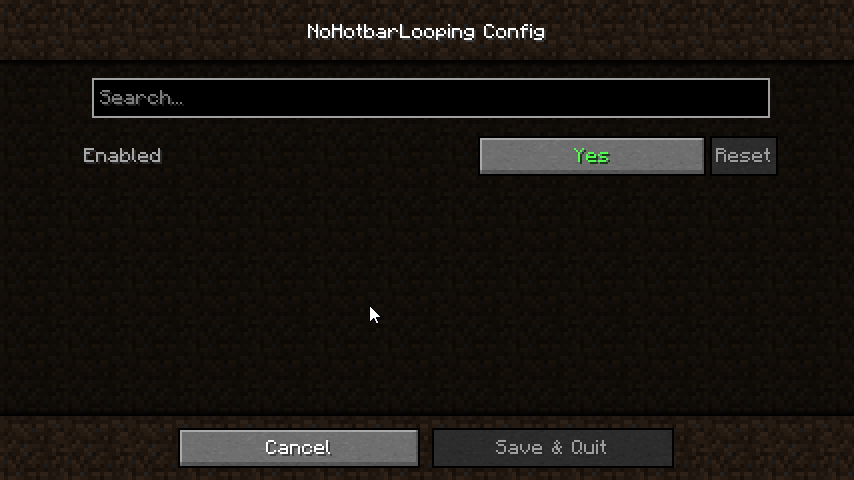

# No Hotbar Looping

Ever wanted your hotbar to not loop when you scroll at the end of it? This mod fixes this!
Simply add this mod to your game, and you can no longer loop through your hotbar.

<!-- TOC -->
* [No Hotbar Looping](#no-hotbar-looping)
  * [Features](#features)
  * [Screenshots](#screenshots)
  * [FAQ](#faq)
  * [Updating the mod](#updating-the-mod)
<!-- TOC -->

## Features

- Toasts
- Keybindings
- ModMenu integration

## Screenshots

## FAQ

* ⛔ I do not allow reuploading of my mods
* ✅ I allow modpacks to use my mods

**Can I use this mod in my modpack?**

Yes! You are more than welcome to include my mod in your modpack, if you credit me properly, and make downloads go through my modrinth page.
I would also appreciate if you told me about it 😊.

**Plz updat to forge**

I won't update to forge, as I have never touched it, and have no plan to do so.

**Will you update this to new MC versions?**

If I feel like it :)

**Where can I get in touch with you?**

Up-to-date contact information can be found at my [GitHub](https://github.com/Erb3/Erb3/blob/main/README.md).

## Updating the mod

> **Note**
> This is how I work when I update the mod to new version. You as a player should not have to do this.

1. Create new branch
2. Update gradle.properties
3. Patch for new release
4. Commit
5. Push & set main-branch to new
6. Build the jar
7. Publish to GitHub Releases
8. Publish to Modrinth